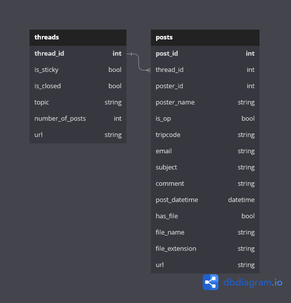

# /pol/-IT : /pol/ Insights from Trolls <!-- omit in toc -->

## End Project for the Data Engineering Bootcamp 2023 <!-- omit in toc -->

- [1. Project Summary](#1-project-summary)
- [2. Why /pol/ ?](#2-why-pol-)
- [3. Data sources](#3-data-sources)
- [4. Data Structure](#4-data-structure)
- [5. ELT Process](#5-elt-process)
  - [EL phase, extracting data from 4chan API and storing it in GCP Buckets](#el-phase-extracting-data-from-4chan-api-and-storing-it-in-gcp-buckets)
  - [T phase, processing the data and storing it in BigQuery](#t-phase-processing-the-data-and-storing-it-in-bigquery)
- [6. Orchestration and Scheduling](#6-orchestration-and-scheduling)
- [7. Data Visualization](#7-data-visualization)
- [8. Deployment needs, infrastructure details and costs](#8-deployment-needs-infrastructure-details-and-costs)
- [9. CI/CD](#9-cicd)
- [How to run the project](#how-to-run-the-project)

## Project: Ingesting data from /pol/ and get insights on trends <!-- omit in toc -->

### 1. Project Summary

The goal of this project is to ingest data from the /pol/ board on 4chan and get insights on trends. The data will be ingested from the 4chan API and stored in GCP Buckets. Mage.ai will be used to orchestrate the ingestion and storage of the data and dbt will be used to transform and clean it. Finally, we'll use a dashboarding tool to visualize the data.

### 2. Why /pol/ ?

Because if we're here to play with data, we might as well have fun by looking for insights from the biggest troll board on the internet. Also, the data is public and free to use.

||
|:--:|
| *Internet Troll in his natural habitat* |

### 3. Data sources

The data will be gathered from the official 4chan API using [BASC-py4chan](https://basc-py4chan.readthedocs.io/en/latest/index.html).

### 4. Data Structure

The data will be stored in BigQuery using two tables:

- `posts`: contains all the posts from the /pol/ board
- `threads`: contains all the threads from the /pol/ board

||
|:--:|
| Data Structure |

### 5. ELT Process

#### EL phase, extracting data from 4chan API and storing it in GCP Buckets

The first step is to extract the data from the 4chan API and store it in GCP buckets. The data will be stored in Parquet format.
Mage.ai will be used to orchestrate the extraction of the data.
For threads, we will create one file per thread naming it `threads_{timestamp}.parquet`.
For posts, we will create one file per thread naming it `posts_{thread_id}_{number_of_posts}.parquet`. This will allow us to easily update the data with each run from the orchestrator.
In addition to that, a second Mage pipeline will be used to transfer the raw data inside BigQuery. This will allow us to have a DataLake in GCP and a DataWarehouse in BigQuery.

|||
|:--:|:--:|
| First Pipeline pulling from 4chan API | Second Pipeline pushing to BigQuery |

#### T phase, processing the data and storing it in BigQuery

For the Transform phase, we will use a DBT model to process the data and create useful tables in BigQuery.
The goal is to populate our two tables `posts` and `threads` with the data we extracted from the 4chan API, taking care of duplicates and cleaning the data when needed.
With each run of the dbt model, we will empty the tables created by the orchestrator and populate the clean tables incrementally.
The posts table will be partitioned by hour for easy access when querying the data.

### 6. Orchestration and Scheduling

Mage.ai will be used to orchestrate the ingestion of the data from the 4chan API and the transfer of the data to BigQuery.
There is two pipelines :

- The first one will pull the data from the 4chan API and store it in GCP buckets (every hour at 25 minutes past the hour)
- The second one will transfer the data from the GCP buckets to BigQuery (every hour at 35 minutes past the hour)

The dbt-cloud job is scheduled to run every 10 minutes.

### 7. Data Visualization

The dashboard is made using Looker Studio and is available here : [DASHBOARD](https://lookerstudio.google.com/reporting/c40419e3-d28a-41bd-b04f-ae5114de5fd6)

### 8. Deployment needs, infrastructure details and costs

For deployment needs, we will use Terraform to create the infrastructure needed to run the project.
The infrastructure will be deployed on GCP.

### 9. CI/CD

We have configured a GitHub Action to update the  mage docker image and push it to the GCP Container Registry every time a new commit is pushed to the `master` branch.
This will allow us to update the mage image without having to rebuild it manually.

### How to run the project

The Mage Dockerfile is available in the `mage_project` folder. You can build the image yourself and run the pipelines.
Keep in mind that you will need to configure the GCP credentials for google cloud storage and BigQuery.
